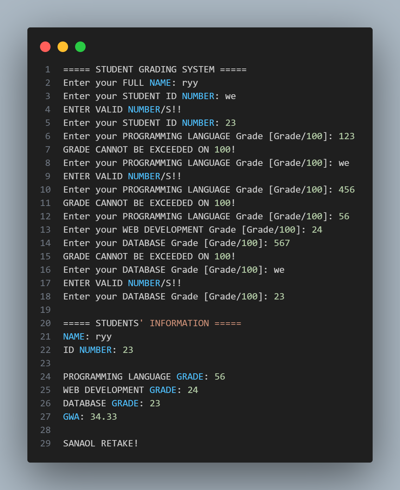

FIRST LABORATORY EXAM: 
SIMPLE STUDENT GRADING SYSTEM

PROBLEM DESCRIPTION: 
- Add student name and ID
- Record grades for 3 subjects
- Calculate and display average grade
- Get letter grade based on average
- OOP Concepts: Class Student; Methods: add_grades(), calculate_average(), display_info(), get_grade_letter()

FULL NAME: 
RYAN JAY E. COMPUESTO

SCREENSHOTS:
